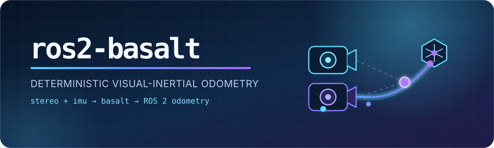
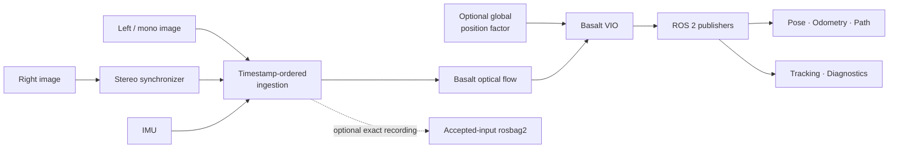

<div align="center">



<br>

[](https://github.com/caiomauro/ros2-basalt/actions/workflows/build.yml)
[](https://docs.ros.org/en/humble/)
[](https://isocpp.org/)
[](LICENSE)
[](#project-status)

**A deterministic, ROS-native integration of
[Basalt](https://github.com/VladyslavUsenko/basalt) visual-inertial odometry.**

Stereo or mono images + IMU in. Standard ROS 2 pose and odometry out.

[Quick start](#quick-start) · [Architecture](#architecture) ·
[Configuration](#configuration) · [Evaluation](#evaluation) ·
[Contributing](CONTRIBUTING.md)

</div>

---

## Why ros2-basalt?

Basalt is fast and accurate, but integrating a VIO estimator into a live ROS 2
system involves more than translating messages. Camera pairs must stay
synchronized, IMU samples must reach the estimator in timestamp order, queues
must remain bounded, and offline runs need to be reproducible.

`ros2-basalt` handles that integration layer while keeping Basalt's estimator
behavior intact:

- **Deterministic ingestion** — ordered image and IMU delivery with direct
  rosbag2 playback for repeatable evaluation.
- **Native ROS interfaces** — pose, odometry, path, point clouds, debug images,
  diagnostics, and a runtime snapshot service.
- **Stereo and mono support** — calibrated stereo VIO or mono operation through
  the same node.
- **Production-minded plumbing** — bounded queues, input-liveness checks,
  estimator-health reporting, and clean startup/shutdown behavior.
- **Flight-stack integration hooks** — optional global-position factors and
  exact accepted-input recording for downstream navigation systems.
- **Reproducible dependency build** — a pinned Basalt revision plus a small,
  documented integration patch.

## Project status

This is **alpha/research software**. It is tested in simulation and against
public datasets, but it is not safety-certified. Do not use it as the sole
position source or safety mechanism on a vehicle.

The maintained platform is Ubuntu 22.04 with ROS 2 Humble. x86-64 and AArch64
(including NVIDIA Jetson) builds are supported by the build configuration, but
hardware-specific calibration and performance validation remain the
integrator's responsibility.

## Architecture



The core package deliberately does not depend on PX4 messages. PX4 conversion,
GPS failover, map localization, and synthetic-GPS injection belong in
downstream navigation packages; this repository exposes the generic VIO
building block they consume.

## Quick start

### 1. Clone and install ROS dependencies

```bash
mkdir -p ~/ros2_ws/src
cd ~/ros2_ws/src
git clone https://github.com/caiomauro/ros2-basalt.git basalt_wrapper

source /opt/ros/humble/setup.bash
cd ~/ros2_ws
rosdep install --from-paths src --ignore-src -r -y
```

### 2. Build the pinned Basalt dependency

```bash
cd ~/ros2_ws/src/basalt_wrapper
./scripts/setup_basalt.sh
```

The bootstrap script checks out Basalt commit
`0f3b2b52c807f70ff4e2973ce253c73329eea7bc`, applies the checked-in
[integration patch](patches/basalt_global_position_factors.patch), trims an
unused RealSense dependency from the local manifest, and builds
`libbasalt.so`. Dependency download and mutation never occur during CMake
configure.

### 3. Build the ROS package

```bash
cd ~/ros2_ws
source /opt/ros/humble/setup.bash
colcon build --packages-select basalt_wrapper --cmake-clean-cache
source install/setup.bash
```

### 4. Launch with your sensor calibration

```bash
ros2 launch basalt_wrapper basalt_node.launch.py \
  input_mode:=ros_topics \
  left_image_topic:=/cam0/image_raw \
  right_image_topic:=/cam1/image_raw \
  imu_topic:=/imu0 \
  calib_path:=/path/to/stereo_calibration.json \
  config_path:=/path/to/vio_config.json
```

For a two-camera calibration, `right_image_topic` is required. Both image
headers must carry the same exposure timestamp, and image/IMU timestamps must
share a clock domain.

## Input modes

### Live ROS topics

`input_mode:=ros_topics` subscribes to camera and IMU topics. Separate callback
groups protect the latency-sensitive IMU stream while the ingestion worker
releases accepted measurements to Basalt in sample-time order.

### Direct rosbag2

`input_mode:=rosbag2` opens a bag inside the node. This avoids ROS playback and
DDS scheduling variability and is the reference mode for reproducible offline
evaluation.

```bash
ros2 launch basalt_wrapper basalt_node.launch.py \
  input_mode:=rosbag2 \
  bag_uri:=/path/to/bag \
  left_image_topic:=/cam0/image_raw \
  right_image_topic:=/cam1/image_raw \
  imu_topic:=/imu0 \
  calib_path:=/path/to/stereo_calibration.json \
  config_path:=/path/to/vio_config.json \
  use_rviz:=false
```

Use `bag_preserve_record_order:=true` only for bags recorded in an already
validated accepted-event order. Normal datasets should use timestamp ordering.

## ROS interface

### Primary inputs

| Parameter | Default | Description |
|---|---|---|
| `left_image_topic` | `/camera/image_raw` | Mono or left image topic |
| `right_image_topic` | empty | Right image; required for stereo calibration |
| `imu_topic` | `/imu/data` | `sensor_msgs/msg/Imu` input |
| `calib_path` | empty | Basalt camera/IMU calibration JSON |
| `config_path` | empty | Basalt VIO configuration JSON |
| `input_mode` | `ros_topics` | `ros_topics` or `rosbag2` |
| `bag_uri` | empty | Bag directory in direct rosbag2 mode |
| `use_imu` | `true` | Enable inertial fusion |
| `use_header_timestamps` | `true` | Use sensor header sample timestamps |

See [the launch file](launch/basalt_node.launch.py) for every exposed argument.

### Outputs

| Topic | Type |
|---|---|
| `/basalt/odometry` | `nav_msgs/msg/Odometry` |
| `/basalt/pose` | `geometry_msgs/msg/PoseStamped` |
| `/basalt/path` | `nav_msgs/msg/Path` |
| `/basalt/pose_cloud` | `sensor_msgs/msg/PointCloud` |
| `/basalt/tracking_image` | `sensor_msgs/msg/Image` |
| `/basalt/tracking_overlay` | `sensor_msgs/msg/Image` |
| `/basalt/tracked_points` | `sensor_msgs/msg/PointCloud` |

Tracking topics are created only when `publish_debug_visuals:=true`.
`/basalt/get_debug_snapshot` (`std_srvs/srv/Trigger`) returns a compact runtime
health snapshot. Optional trajectory, ingestion, and diagnostics files are
controlled by `trajectory_output_path`, `ingest_log_path`, and
`diagnostics_log_path`.

## Configuration

A stereo calibration JSON must contain two camera intrinsics, two `T_imu_cam`
transforms, image resolutions, IMU rate, and positive noise and bias random-walk
values. Calibration must represent the physical sensor geometry and timestamp
convention. The files under [`config/`](config/) are simulation examples, not
universal camera profiles.

`use_camera_info_calibration:=true` can construct a simple parameter-based
camera model for experiments. Real deployments should use `calib_path`; full
stereo extrinsics and IMU noise parameters cannot be inferred from image
messages.

### Build options

| CMake option | Default | Purpose |
|---|---:|---|
| `BASALT_WRAPPER_BUILD_RVIZ_PLUGIN` | `ON` | Build the camera-preview RViz plugin |
| `BASALT_WRAPPER_BUNDLE_BASALT_LIBRARY` | `ON` | Install `libbasalt.so` with the package |
| `BASALT_WRAPPER_MARCH` | detected | Match the architecture used to build Basalt |

The wrapper reads Basalt's `CXX_MARCH` from its CMake cache because Eigen
alignment and template layouts must match across the shared-library boundary.
For a portable rather than host-optimized build:

```bash
BASALT_CXX_MARCH=x86-64 ./scripts/setup_basalt.sh
```

An existing compatible Basalt checkout can be supplied with
`-DBASALT_ROOT=/path/to/basalt`; use `-DBASALT_LIBRARY=/path/to/libbasalt.so`
when the library is outside its standard build location.

## Evaluation

The wrapper's direct rosbag2 path has been compared against native Basalt on
EuRoC `V1_02_medium`:

| Runner | APE RMSE |
|---|---:|
| Native `basalt_vio` | **0.045336 m** |
| `ros2-basalt` direct rosbag2 | **0.045331 m** |

This shows numerical parity for one tested dataset, revision, and platform. It
is a regression baseline—not a universal accuracy guarantee. Live performance
also depends on calibration, clock synchronization, driver behavior, motion,
lighting, and scene texture.

The repository includes utilities for EuRoC conversion, truth publication, TUM
trajectory extraction/comparison, simulation calibration checks, and resource
tracking. Example:

```bash
ros2 run basalt_wrapper euroc_to_rosbag2 --ros-args \
  -p dataset_path:=/path/to/EuRoC/V1_02_medium \
  -p output_uri:=/path/to/V1_02_medium_ros2
```

## Test and develop

```bash
cd ~/ros2_ws
source /opt/ros/humble/setup.bash
colcon build --packages-select basalt_wrapper --cmake-clean-cache
colcon test --packages-select basalt_wrapper --event-handlers console_direct+
colcon test-result --verbose
```

GitHub Actions builds the pinned Basalt revision and wrapper, runs ROS/C++/Python
linters and tests, smoke-tests the installed node through startup and shutdown,
and rejects checkout-specific runtime paths.

## Known limitations

- Calibration is not estimated online.
- Correct VIO requires hardware synchronization or accurately aligned sensor
  timestamps.
- Floating-point results may vary across compilers and architectures.
- Health thresholds reject clearly implausible output but cannot prove every
  estimate correct.
- Global-position factors are an experimental integration point, not a complete
  map-localization or GPS-denied navigation system.

## License

`ros2-basalt` is distributed under the [BSD 3-Clause License](LICENSE). Basalt
is also BSD 3-Clause licensed; see [THIRD_PARTY_NOTICES.md](THIRD_PARTY_NOTICES.md)
for its attribution and the integration-patch notice.
